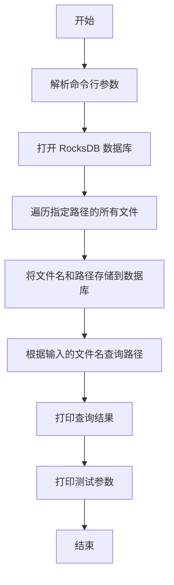

# Rocks_DB for search files(Rust) 

## 流程图



# 文件索引器

这是一个使用 Rust 和 RocksDB 实现的文件索引器。它允许用户指定一个目录路径，并将该路径下的所有文件名及其对应路径存储到 RocksDB 数据库中。用户可以通过文件名快速查询其路径。

## 功能

- 遍历指定路径下的所有文件。
- 将文件名及其路径存储到 RocksDB 数据库。
- 通过文件名查询文件路径。

## 开始

以下指南将帮助您在本地机器上设置和运行此项目。

### 先决条件

在开始之前，您需要安装以下内容：

- Rust 编程语言
- Cargo（Rust 的包管理器）

### 安装

1. 克隆此仓库到您的本地机器上：

   ```bash
   git clone https://github.com/BriceLucifer/rust-search.git

1. 进入项目目录：

   ```
   cd rust-search
   ```

2. 构建项目：

   ```
   cargo build
   ```

## 使用

运行程序，传入文件名和路径参数：

```
cargo run -- --name "file_name" --path "your_directory_path"
```

### 命令行参数

- `--name` 或 `-n`: 要查询的文件名。
- `--path` 或 `-p`: 文件索引的目录路径。
- `--debug` 或 `-d`: 启用调试模式。
- `--count` 或 `-c`: 设置计数（带默认值）。

## 部署

此项目可作为命令行工具部署在任何支持 Rust 的环境中。

## 作者

- BriceLucifer

## 许可证

此项目根据 MIT 许可证授权 - 请参阅 `LICENSE` 文件了解详细信息
